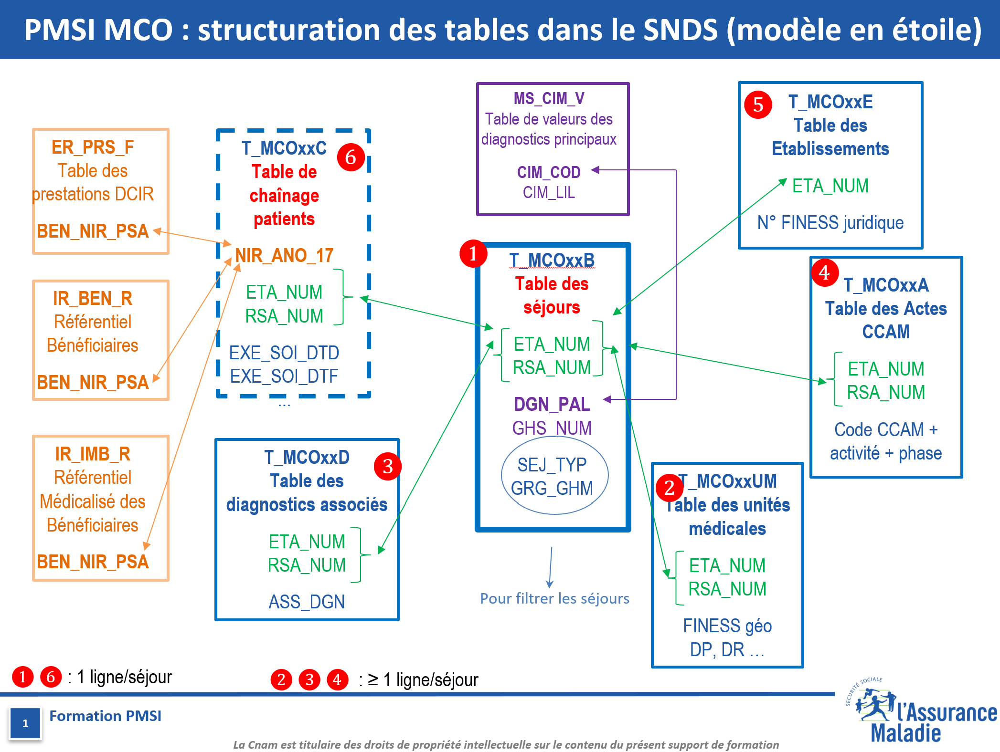

# Extraction des données MCO (SNDS)

Cette page propose un code d'extraction des données de Médecine Chirurgie Obstétrique (MCO) depuis les données du Programme de Médicalisation des Systèmes d'Information (PMSI) de la base du Système National des Données de Santé (SNDS). Ces données étant très riches, cette page propose une extraction simplifiée pour les utilisateurs novices. Ces extractions permettent notamment la création d'une base en panel, par exemple par année-mois-établissement, afin d'obtenir les principaux indicateurs d'hospitalisation : nombre de séjours, nombre de jours d'hospitalisation, par catégorie de séjour et de sévérité.

Cette page est dédiée à l'extraction des données via l'espace SNDS. Les données MCO sont également disponibles via la plateforme ATIH, mais les noms des variables peuvent différer.

## Accès aux données

L'accès aux données nécessite une autorisation spécifique, soit par demande sur projet ([CESREES et CNIL](https://www.health-data-hub.fr/starter-kit)), soit via un accès permanent accordé aux laboratoires académiques (ex. CNRS) ou aux établissements de santé (CHU).

## Structure de l'espace SNDS

L'espace SNDS est structuré en plusieurs dossiers :

- **oravue** : bibliothèque Oracle contenant toutes les tables de données de consommation de soins, notamment les tables MCO
- **work** : dossier SAS vidé chaque nuit, destiné au stockage temporaire des tables
- **orauser** : bibliothèque Oracle pour le stockage temporaire des tables (à nettoyer régulièrement par les utilisateurs)
- **sasdata1** : dossier SAS dédié au stockage des tables de l'utilisateur

## Données

Les données MCO sont réparties sur plusieurs tables avec des niveaux d'agrégation différents, reliées par des jointures distinctes.

<figure align="center">
  
  <figcaption><em>Figure 1 : Schéma des jointures entre les tables MCO. La table centrale T_MCOxxB est reliée aux autres tables via ETA_NUM ou ETA_NUM + RSA_NUM.</em></figcaption>
</figure>


Le HDH met à disposition une [présentation détaillée](lien) de l'utilisation des données du PMSI, qui incluent les MCO.

Toutes les données sont découpées par année et contiennent l'ensemble des séjours ayant au moins un jour sur l'année en cours.

La table centrale de la base MCO est la table Bloc `T_MCOxxB` pour l'année `xx`. L'image ci-dessus montre les liens de jointure entre les tables, via `ETA_NUM` (numéro de l'établissement) ou via `ETA_NUM` et `RSA_NUM` (numéro du séjour, unique par établissement et par année).

## Code

Le code ci-dessous est écrit pour SAS Enterprise Guide, le logiciel principal utilisé dans l'exploitation du SNDS, particulièrement adapté à la volumétrie de ces bases. Si vous souhaitez utiliser R, la CNAM fournit également un [guide](lien), mais cela nécessite généralement de passer par un moteur Oracle pour gérer la volumétrie conséquente de ces bases.

Le code utilise notamment la macro [`%connector`](lien) qui permet le recours au moteur Oracle et donc de meilleures performances.

```r
# Exemple d'utilisation
source("main.R")
```

## Auteurs

[Shervin Karimi](https://shervinkarimi.github.io/website/)
